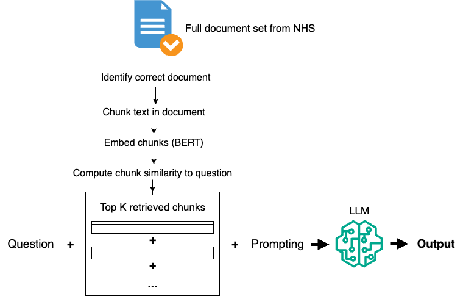

# Patient QA System with Retrieval-Augmented Generation

A patient question-answering system that retrieves vetted NHS documents and generates accurate, fluent responses using Retrieval-Augmented Generation (RAG) techniques.



## Overview

Patient QA systems provide health-related information to the public, requiring strict safeguards for accuracy. This project develops a RAG pipeline that achieves both **high factual precision** and **natural conversational fluency** — addressing a critical gap in existing patient-facing health information systems.

**Key Challenge:** Traditional patient QA chatbots use rigid keyword matching (sacrificing fluency), while generative AI approaches often hallucinate. This project demonstrates that RAG can deliver both accuracy and fluency.

## Results

| Metric | Baseline | Optimized | Improvement |
|--------|----------|-----------|-------------|
| **ROUGE-Lsum Precision** | 0.39 | 0.55 | +40% |
| **BERT F1 Score** | 0.91 | 0.93 | +2% |
| **Fluency** | 100% | 100% | Perfect |
| **Hallucinations** | 2 minor | 0 | Zero |
| **No Omissions** | 62% | 68% | +6% |

- **40% improvement** in text similarity to expert answers
- **Zero hallucinations** — fully grounded in NHS source documents
- **100% fluency** — natural, conversational responses
- **92.6% BERT F1** — high semantic accuracy

## Methodology

### Baseline Model
- **Retrieval:** TF-IDF sparse retrieval (k=5 chunks)
- **Chunking:** Paragraph-based splitting on double newlines
- **Generation:** Phi-4-mini-instruct LLM with basic prompting

### Optimized Model
- **Retrieval:** BioBERT dense embeddings + FAISS vector search
- **Chunking:** Intelligent merging (minimum 10 words per chunk)
- **Top-k:** Increased from 5 to 15 retrieved chunks
- **Prompting:** Zero-shot instruction tuning for conciseness and fidelity
- **Generation:** Phi-4-mini-instruct with constrained generation

## Dataset

**OpenGPT Dataset** (CogStack, UCL/KCL)
- 211 expert-validated question-answer pairs
- 23 unique diseases (e.g., Bronchiolitis, Multiple sclerosis, Laryngitis)
- Each QA pair linked to vetted NHS reference documents
- Evaluation metrics: ROUGE-Lsum precision, BERTScore, manual assessment

## Key Technical Innovations

### 1. Dense Retrieval with BioBERT
BioBERT embeddings capture both contextual and biomedical meaning through sub-word tokenization, enabling semantic matching between patient questions (lay language) and clinical NHS text.

### 2. Improved Text Chunking
Naive paragraph splitting created meaningless short chunks. The optimized method merges adjacent chunks <10 words, reducing average chunks from 21.1 to 12.5 per document while improving semantic coherence.

### 3. Prompt Engineering
System prompts refined based on analysis showing reference answers averaged 1.97 sentences:
> "You are a friendly, knowledgeable medical expert who explains health topics in a clear, compassionate, and patient-friendly way. Please provide your answer in 1-2 complete sentences unless the question requires elaboration."

## Installation

### Requirements
- Python 3.11+
- CUDA-capable GPU (recommended for BioBERT inference)
- Google Colab (optional, for notebook version)

### Setup

```bash
# Clone the repository
git clone https://github.com/rgbweston/patient-qa-system.git
cd patient-qa-system

# Install dependencies
pip install -r requirements.txt

# Download BioBERT model (done automatically on first run)
# Download Phi-4-mini-instruct (done automatically on first run)
```

## Usage

### Running the Baseline Model

```python
python src/baseline_model.py \
  --docs_path path/to/nhs_documents.zip \
  --test_csv path/to/patient_qa_test.csv \
  --k 5 \
  --answer_limit 50
```

### Running the Optimized Model

```python
python src/optimized_model.py \
  --docs_path path/to/nhs_documents.zip \
  --test_csv path/to/patient_qa_test.csv \
  --k 15 \
  --answer_limit 50
```

### Parameters
- `--docs_path`: Path to ZIP file containing NHS reference documents
- `--test_csv`: Path to test set CSV with question-answer pairs
- `--k`: Number of top chunks to retrieve (default: 5 for baseline, 15 for optimized)
- `--answer_limit`: Number of questions to process (211 total in test set)

## Project Structure

```
patient-qa-system/
├── README.md                 # Project overview and documentation
├── requirements.txt          # Python dependencies
├── images/
│   └── qa_system_architecture.png
├── src/
│   ├── baseline_model.py     # TF-IDF retrieval + LLM generation
│   ├── optimized_model.py    # BioBERT + FAISS retrieval + LLM
│   └── utils.py              # Shared utilities (chunking, evaluation)
└── notebooks/
    └── exploratory_analysis.ipynb  # Full experimental notebook
```

## Technical Stack

- **BioBERT** (`dmis-lab/biobert-base-cased-v1.1`) - Biomedical language model
- **FAISS** - Efficient vector similarity search
- **Phi-4-mini-instruct** (Microsoft) - Instruction-tuned LLM for generation
- **ROUGE-Lsum** - Precision metric for text similarity
- **BERTScore** - Semantic similarity evaluation
- **PyTorch** - Deep learning framework
- **Transformers** (Hugging Face) - Model implementation

## Evaluation Metrics

### Automatic Metrics
- **ROUGE-Lsum Precision:** Measures word-level similarity at multi-sentence level
- **BERTScore F1:** Semantic similarity using contextual embeddings

### Manual Evaluation (Likert Scale 1-5)
- **Omission:** Completeness of information (1 = no omission)
- **Hallucination:** Factual accuracy (1 = fully grounded, no fabrication)
- **Fluency:** Natural language quality (1 = perfectly fluent)

## Key Findings

1. **Dense retrieval (BioBERT) outperforms sparse retrieval (TF-IDF)** particularly at higher k values, due to semantic understanding beyond keyword matching

2. **Increasing k from 5 to 15 yielded the largest single improvement** (+18.3% ROUGE-Lsum), suggesting more context enables better synthesis

3. **Zero hallucinations achieved** through strict grounding in NHS source documents and careful prompting

4. **Perfect fluency maintained** while improving accuracy — demonstrating RAG can achieve both goals

## Limitations & Future Work

### Current Limitations
- Some omissions of critical escalation information (e.g., emergency care guidance)
- Chunking could be further optimized
- Computational cost of evaluating extensive RAG hyperparameter combinations

### Future Directions
- **Sliding-window chunking:** 128-2048 token windows with overlap
- **AutoRAG:** Automated hyperparameter optimization using Bayesian methods
- **Context-dependent chunking:** Framework for adaptive chunking strategies
- **Extended evaluation:** Larger test sets, multi-turn conversations

## Research Context

This project addresses a critical gap in patient QA systems:
- **Existing commercial systems** (WHO COVID-19 bot, NHS-Alexa) use retrieval-only methods with rigid template responses
- **Academic prototypes** either stop at snippet extraction or lack vetted health authority documents
- **No prior work** demonstrated an auditable RAG pipeline achieving high factual precision with natural fluency

## Citation

If you use this work, please cite:

```
Barrowcliff, R. (2025). Patient QA System Development with Retrieval-Augmented Generation.
Institute of Health Informatics, UCL. Advanced Machine Learning for Healthcare (CHME0035).
```

## References

- **OpenGPT Dataset:** [CogStack/OpenGPT](https://github.com/CogStack/OpenGPT)
- **BioBERT:** Lee et al. (2020) - BioBERT: a pre-trained biomedical language representation model
- **FAISS:** Johnson et al. (2019) - Billion-scale similarity search with GPUs
- **Phi-4-mini-instruct:** Microsoft (2025) - [Hugging Face Model](https://huggingface.co/microsoft/Phi-4-mini-instruct)

## License

This project is for educational and research purposes. NHS content remains under Crown Copyright.

## Author

**Rohan Barrowcliff**
- Health Data Scientist
- Institute of Health Informatics, UCL
- [Portfolio](https://rgbweston.github.io) | [LinkedIn](https://linkedin.com/in/rohanbarrowcliff) | [GitHub](https://github.com/rgbweston)

## Acknowledgments

- CogStack team (UCL/KCL) for the OpenGPT dataset
- NHS for vetted health information documents
- UCL Institute of Health Informatics

---

**Keywords:** RAG, Retrieval-Augmented Generation, Patient QA, BioBERT, FAISS, NLP, Healthcare AI, LLM, Clinical NLP
